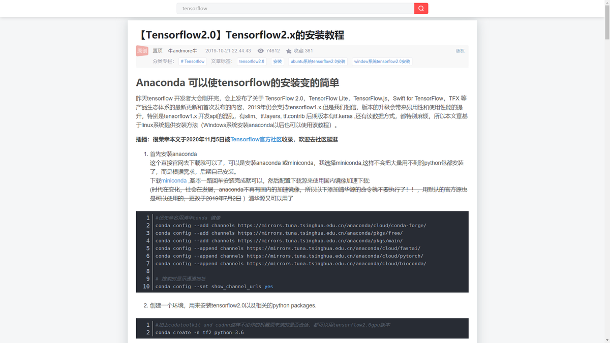

# Scripts-for-TamperMonkey

## 油猴脚本 仓库说明

本仓库是用于日常上网使用的油猴脚本, 支持网站和功能会逐渐丰富, 欢迎提交[意见建议](https://github.com/Germxu/Scripts-for-TamperMonkey/issues/new), 期待您的 star ^\_^

## 下载与安装

| 脚本       |                                 地址                                 |                              地址                              |
| :--------- | :------------------------------------------------------------------: | :------------------------------------------------------------: |
| CSDN Focus | [greasyfork](https://greasyfork.org/zh-CN/scripts/420352-csdn-focus) | [openuserjs](https://openuserjs.org/scripts/Germxu/CSDN_Focus) |

## CSDN Focus

使用 `GM_addStyle` 在 `document_start` 注入重置样式, 页面初始化就是修改后的样式, 避免页面重新渲染的尴尬效果

#### v 0.6
功能优化: 添加外链直达, 干掉跳转提醒

#### v 0.5
功能优化: 显示顶部搜索栏,优化过渡显示

#### v 0.4
Bugfix: 大屏幕右侧边栏隐藏, 大小屏幕都居中显示

more

#### v 0.3
展开全部评论和评论翻页, 隐藏登录窗

#### v 0.2

由于通过 js 查找节点注入样式的时间节点必须靠后, 势必导致页面的重绘, 此版本将 js 注入改为 `GM_addStyle` API 的纯 css 注入, 代码更简洁, 不影响页面加载, 甚至比原页面更快显示最终状态

#### v 0.1

只显示页面文章和评论, 其他全部隐藏

**截图**
 

&emsp;  
&emsp;  

## 后话:

开发初衷: 由于同事的一个第三方后台页面的插件需求, 我研究了使用油猴脚本, 效果非常满意, 开发快捷, 所见即所得. 虽然 Chrome 插件开发也很简单, 但是油猴脚本相比不需要审核, 开发发布更容易, 因为不需要翻墙, 用户也更方便下载使用, 因此目前会尽力在 Tampermonkey 的框架下开发一些脚本工具. 但是 Chrome 扩展的权限和功能更强大, 比如同步存储独立界面等等, 后期也会将需要更多强大功能的扩展工具提交到 Chrome 商店, 毕竟 $5 的开发者会费已经交了好几年 hhh~~~
